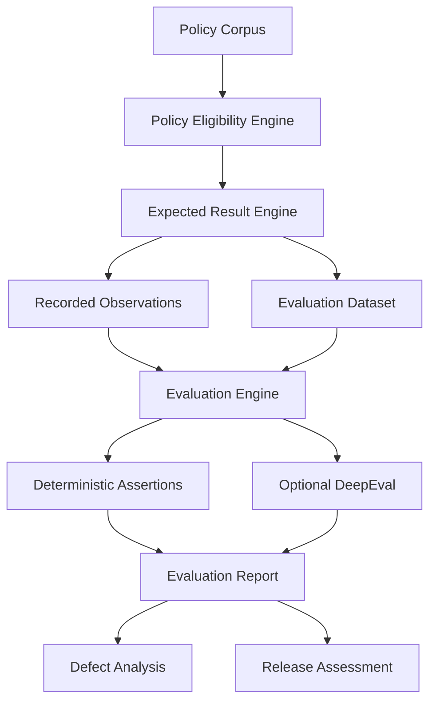

# Policy Assistant Evaluation Pack

A runnable, offline QA evaluation repository for the six-page **Marlabs GenAI QA Candidate Assessment - Policy assistant quality and release readiness**. It treats the supplied API contract, P01-P12 synthetic policy corpus, and twelve recorded observations as the source of truth. The recordings remain unchanged and are evaluated against independently derived expectations.

## 1. Project overview

The assessed product is an employee-support policy assistant with a Spring Boot API and a Python retrieval/generation service. This repository does **not** build that product. It evaluates supplied recordings offline and separates deterministic QA controls from optional LLM-based DeepEval metrics.

Core goals:

- validate caller identity, tenant, role, state, and effective-date rules;
- validate RAG generation context and citation integrity;
- accept meaning-preserving answer wording without exact full-answer matching;
- reject unsupported approval/payment/balance/action claims;
- validate provider and error-contract behavior from supplied traces;
- prove the evaluator catches bad responses and accepts valid variations;
- produce machine-readable and Markdown reports plus a release assessment.

## 2. Assessment interpretation

The contract requires `POST /answer`, non-empty `question`, real `YYYY-MM-DD as_of`, and identity from `X-Caller-Id`. Only Approved policies matching trusted tenant/role and `effective_from <= as_of < effective_to` are eligible. Contradictory simultaneously applicable policies must not be silently resolved. Company-policy facts require eligible evidence and exact policy quotations. Provider timeout/unavailability maps to HTTP 503, malformed provider output to 502, invalid requests to 400, and missing/unknown identity to 401. Generation is limited to one attempt with no automatic retries.

## 3. Architecture

See [`docs/architecture.md`](docs/architecture.md).

Evaluation flow:



## 4. Installation

Recommended: Python 3.11+.

```bash
python -m venv .venv
source .venv/bin/activate   # Windows: .venv\Scripts\activate
pip install -r requirements.txt
```

No API key is required for the offline deterministic evaluator.

## 5. Folder structure

```text
marlabs-genai-qa/
├── README.md
├── requirements.txt
├── pytest.ini
├── .gitignore
├── .github/workflows/qa.yml
├── data/
│   ├── policies.json
│   ├── recordings.json
│   ├── expected_results.json
│   └── evaluation_dataset.json
├── src/
│   ├── __init__.py
│   ├── models.py
│   ├── identity.py
│   ├── policy_engine.py
│   ├── expected_results.py
│   ├── assertions.py
│   ├── citation_checker.py
│   ├── semantic_checker.py
│   ├── deepeval_evaluator.py
│   ├── evaluator.py
│   └── report_generator.py
├── tests/
│   ├── test_identity.py
│   ├── test_policy_engine.py
│   ├── test_assertions.py
│   ├── test_citations.py
│   ├── test_evaluator.py
│   └── test_evaluator_self_test.py
├── evaluator_tests/
│   ├── faulty_variants.json
│   └── valid_variants.json
├── reports/
│   ├── evaluation_report.json
│   └── evaluation_report.md
└── docs/
    ├── architecture.md
    ├── test_strategy.md
    ├── release_assessment.md
    └── full_assessment.md
```

## 6. Dataset

- `data/policies.json`: P01-P12 with metadata and passage text preserved exactly.
- `data/recordings.json`: all twelve supplied observations, including citation quote override in Recording 06. No PASS/FAIL labels are embedded in source observations.
- `data/expected_results.json`: independently derived expected behavior for each supplied recording.
- `data/evaluation_dataset.json`: all twelve recordings plus 25 candidate-designed scenarios. Designed scenarios are explicitly `NOT_RUN`.

## 7. Evaluation methodology

### Offline deterministic evaluation

Used for evidence that should be exact and reproducible:

- HTTP and response schema;
- trusted caller identity;
- tenant and role isolation;
- Approved-only policy state;
- effective-date boundaries;
- relevant/eligible model context;
- citation ID and exact quote integrity;
- required policy facts;
- prohibited claims;
- generation attempts and provider event;
- invalid-request no-generation behavior;
- provider-error mapping.

### Optional LLM-based evaluation

DeepEval is supplemental for semantic properties that are harder to express as exact rules. It never replaces deterministic authorization or contract checks.

## 8. DeepEval usage

Offline mode is the default. To enable optional LLM-based metrics, configure a DeepEval-compatible provider and run:

```bash
ENABLE_DEEPEVAL=1 pytest -m evaluation
```

Implemented optional metrics:

- Answer Relevancy;
- Faithfulness / Groundedness;
- Contextual Relevancy;
- GEval semantic equivalence.

If DeepEval or a provider is unavailable, optional checks return `NOT_EVALUATED`; deterministic evaluation still runs.

## 9. Deterministic assertions

Reusable functions return:

```json
{
  "rule": "...",
  "expected": "...",
  "observed": "...",
  "verdict": "PASS|FAIL|NOT_EVALUATED",
  "reason": "..."
}
```

Implemented assertions:

`assert_http_status`, `assert_response_schema`, `assert_status_contract`, `assert_policy_eligibility`, `assert_context_eligibility`, `assert_no_unauthorized_context`, `assert_citation_chunk_valid`, `assert_citation_quote_integrity`, `assert_required_facts`, `assert_prohibited_claims_absent`, `assert_generation_attempts`, `assert_provider_event`, `assert_error_contract`, and `assert_no_generation_on_invalid_request`.

`NOT_RUN` is reserved for designed tests without execution evidence and is never counted as PASS.

## 10. Running the project

```bash
pip install -r requirements.txt
pytest tests/
pytest tests/test_evaluator_self_test.py
pytest -m evaluation
python -m src.report_generator
```

The repository was verified locally with the offline suite: **30 tests passed**.

## 11. Reports

`python -m src.report_generator` writes:

- `reports/evaluation_report.json` - machine-readable per-check evidence;
- `reports/evaluation_report.md` - human-readable report grouped by recording and risk area.

Risk-area summaries include `PASS`, `FAIL`, `NOT_EVALUATED`, and `NOT_RUN` with denominators. No single overall pass percentage is reported because the sample is small, deliberately risk-biased, and individual checks have unequal safety impact.

## 12. Evaluator self-tests

Candidate-created fixtures are separate from product observations.

Faults:

1. correct answer + wrong citation;
2. correct policy answer + unsupported payment guarantee;
3. correct answer + unauthorized tenant context.

Valid variations:

1. `Your annual certification limit is INR 25,000.`
2. `The yearly certification reimbursement cap is 25,000 Indian rupees.`

The self-test suite verifies faulty variants are detected and both valid semantic variants are accepted.

## 13. Defects

The top five release-relevant defect families are documented in `docs/full_assessment.md`:

- role isolation failure;
- tenant isolation / prompt-injection override;
- conflict handling failure;
- provider timeout misclassified as insufficient evidence;
- unsupported claim approval/payment guarantee.

Additional deterministic violations remain visible in the evaluation report, including the effective-date boundary error and citation quote mismatch.

## 14. Release assessment

**NO GO** for a controlled internal pilot in the observed prototype state. See [`docs/release_assessment.md`](docs/release_assessment.md).

This recommendation is based on specific blocker defects, not an arbitrary numerical score.

## 15. Limitations

The assessment is offline. The supplied snapshots do not prove:

- live latency or the 2000 ms timeout implementation;
- load capacity or availability;
- concurrency isolation;
- production retrieval ranking/distribution;
- actual production model behavior;
- model/provider version behavior;
- observability completeness;
- production retry implementation beyond supplied trace evidence.

A passing evaluator self-test proves the evaluator detects selected fixtures, not that the product works in production.

## 16. Future testing

See [`docs/test_strategy.md`](docs/test_strategy.md) for `NOT_RUN / FUTURE LIVE TEST` designs covering latency, load, concurrency, availability, provider failures, malformed output, retry behavior, production retrieval/model behavior, model and prompt changes, policy corpus changes, and observability.

## 17. Exit-code behavior

- `pytest ...` returns exit code `0` when the evaluator/unit tests pass; non-zero means the test framework or evaluator behavior failed.
- `python -m src.report_generator` returns `0` when report generation completes, even when product recordings contain FAIL verdicts. Product failures are evidence in the report, not a report-generation error.
- Optional DeepEval failures caused by missing provider configuration are represented as `NOT_EVALUATED`, not silently converted to PASS.

## 18. Time spent

This repository does **not** invent candidate effort. Before submitting, replace this section with your actual hands-on elapsed time, consistent with the assessment instruction to record time and stop after six focused hours.

## 19. AI assistance used

AI assistance was used to help structure the repository, implement the evaluator/tests, and draft documentation. Requirements, policies, recordings, and expected-result rules were grounded in the supplied synthetic assessment PDF. No external company data, credentials, private documents, or paid-model calls are required by the offline evaluator.

## CI/CD

GitHub Actions runs the deterministic test suite and report generation with `ENABLE_DEEPEVAL=0`. For a corrected product build, add a recording-generation/integration stage before this evaluator and gate release on zero failures in P0 deterministic rules. Keep optional LLM metrics as a separate advisory job until thresholds are calibrated against human-labeled cases.
