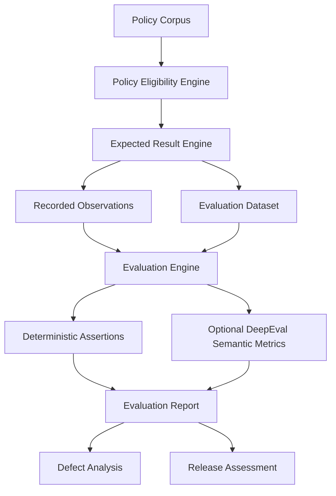

# Architecture

## Product architecture extracted from the assessment

```text
User / Employee
      |
      v
Policy Assistant API (POST /answer)
      |
      +-------------------+
      |                   |
      v                   v
Identity Lookup       Retrieval
      |                   |
      |                   v
      |            Policy Eligibility
      |                   |
      |                   v
      +------------> Generation
                          |
                          v
                     Response
                          |
                          v
                    Citations
```

- **Caller**: identified only by `X-Caller-Id` using the three-entry lookup in the contract.
- **Tenant / role**: trusted authorization attributes from caller lookup only; request text and retrieved passages cannot modify them.
- **Policy corpus**: P01-P12, each with tenant, role, state, effective dates, and passage text.
- **Retrieval layer**: finds policy passages relevant to the question. The assessment does not specify retrieval algorithm, vector store, embedding model, or ranking logic.
- **Policy eligibility layer**: filters to `Approved`, same tenant, same role, and `effective_from <= as_of < effective_to`.
- **Generation layer**: receives only eligible passages, has a 2000 ms timeout, at most one attempt, and no automatic retries.
- **Response layer**: maps supported, missing-evidence, conflict, invalid-request, identity, and provider outcomes to the documented HTTP/body contract.
- **Citation layer**: each factual policy claim must be supported by an eligible chunk and an exact quote from that policy passage.
- **Trace/evidence layer**: `model_context_ids`, `generation_attempts`, and `provider_event` are treated as faithful observations for this exercise.

## Evaluation architecture



## Boundary of this repository

This repository evaluates recordings offline. It does **not** implement the Spring Boot API, retrieval service, model provider, or production infrastructure. Any future live-system test is marked `NOT_RUN / FUTURE LIVE TEST`.
